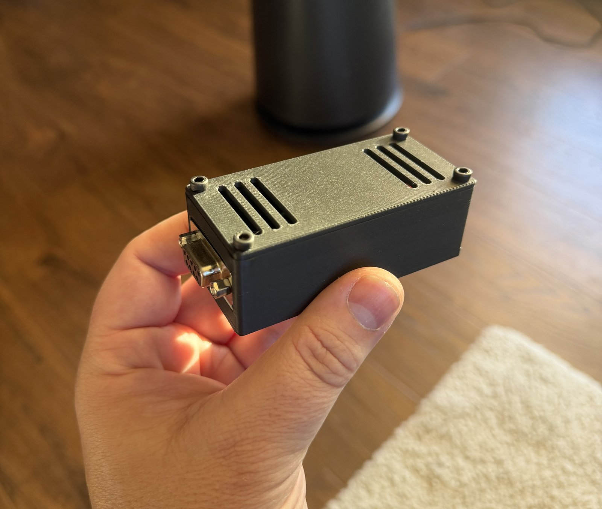
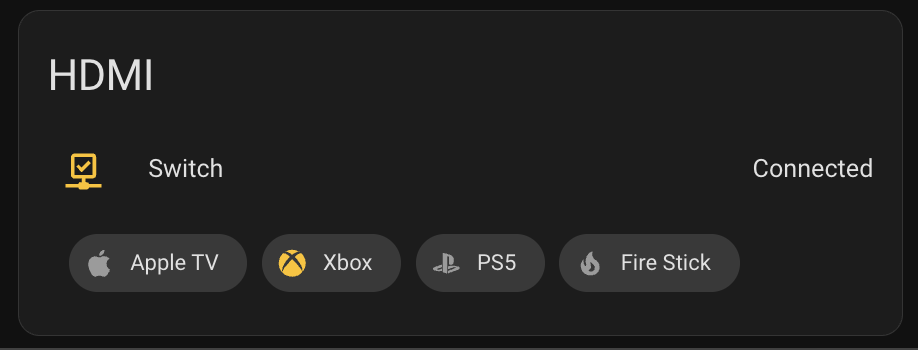

# ATEN HDMI switcher "smart" bridge

So you bought an ATEN HDMI switcher which has RS232 control because you want to turn it into something "smart" as part of your home automation... Congrats! I did the same!

This is what I built: an ESP32 running [ESPHome](https://esphome.io/) that controls an ATEN VS481C over its RS232 port from Home Assistant. Let me know if it's useful to you!





The switch acknowledges every command and can be polled for its state, so this shows the input that is *actually* selected, including changes made from the IR remote or the front panel, and Home Assistant gets four buttons rather than a slider. Two LEDs on the case say whether it's connected and whether the switch is answering.

This replaced an earlier Raspberry Pi and Go daemon design; see [Legacy](#legacy) at the bottom.

## Hardware

| Part | Notes |
|---|---|
| [ATEN VS481C](https://www.aten.com/gb/en/products/professional-audiovideo/video-switches/vs481c/) | Other ATEN switches with the `sw i0N` command set should work too |
| ESP32-WROOM-32 devkit, 30-pin, USB-C | Any classic ESP32 devkit. Wires soldered to the pin tails, board mounted upside down |
| HW-044 MAX3232 module, female DB9 | The common small blue RS232-to-TTL board |
| DB9 male-to-male **null modem** cable | Must be crossover. Both the switch and the module transmit on pin 2 |
| 2 × 3 mm LEDs, green and red | Green through 220 Ω, red through 330 Ω |
| USB-C power supply | A wall adapter, not a TV USB port that switches off with the TV |
| 3D printed case, PETG | Designed in Fusion 360, not in this repo. Constraints in [esphome-build.md](esphome-build.md#case) |

## Wiring

| From | To |
|---|---|
| Module VCC | ESP32 3V3 |
| Module GND | ESP32 GND |
| Module TXD | ESP32 GPIO17 |
| Module RXD | ESP32 GPIO16 |
| Green LED, long leg via 220 Ω | ESP32 GPIO25 |
| Red LED, long leg via 330 Ω | ESP32 GPIO26 |
| LED short legs | ESP32 GND |
| Module DB9 | Switch RS232 port, via the null modem cable |

If the switch never answers, swap TXD and RXD at the module before suspecting anything else; the labelling on those boards is inconsistent.

## Firmware

The whole thing is [`hdmi-switch.yaml`](hdmi-switch.yaml). Create `secrets.yaml` next to it with your `wifi_ssid` and `wifi_password` (it's gitignored), then:

```
esphome run hdmi-switch.yaml --device /dev/cu.usbserial-0001   # first flash, over USB
esphome run hdmi-switch.yaml --device hdmi-switch.local          # every flash after that, over the air
esphome logs hdmi-switch.yaml --device hdmi-switch.local         # watch it work
```

What it does:

- Talks to the switch at 19200 8N1 on UART2.
- Exposes four switch entities, **Input 1** to **Input 4**. Each is on only while that input is the active one; turning one on sends the command, turning one off does nothing.
- After every command it waits for the switch's `Command OK` echo, and resends once if nothing comes back within 600 ms.
- Polls the switch with `read` every 30 seconds, held off for 3 seconds after any command so the two can't collide, and updates the active input from the reply.
- Exposes **Switch Responding**, a connectivity sensor that goes off if the switch hasn't replied to anything for 90 seconds. This is the "cable fell out" alarm.
- Exposes **Last Switch Response** as a text sensor for debugging. It only publishes command acknowledgements, rejections and the active-input line of a `read` reply, and only when the text differs from the last one published, so the 30-second poll doesn't fill the Home Assistant logbook. Also a **Restart** button.
- Drives the two LEDs by PWM, green at full and red at half, balanced on the bench:

| LED | Meaning |
|---|---|
| Green steady | Powered, Wi-Fi up, Home Assistant connected |
| Green blinking | Powered but no Home Assistant connection |
| Red on | The switch hasn't replied for 90 seconds |

## Home Assistant

Add the device through the ESPHome integration; it's discovered automatically. Then a card like this, or the same `buttons` row dropped into whatever entities card the room already uses:

```yaml
type: entities
title: HDMI
state_color: true
show_header_toggle: false
entities:
  - entity: binary_sensor.hdmi_switch_switch_responding
    name: Switch
  - type: buttons
    entities:
      - entity: switch.hdmi_switch_input_1
        name: Apple TV
        icon: mdi:apple
      - entity: switch.hdmi_switch_input_2
        name: Xbox
        icon: mdi:microsoft-xbox
      - entity: switch.hdmi_switch_input_3
        name: PS5
        icon: mdi:sony-playstation
      - entity: switch.hdmi_switch_input_4
        name: Fire Stick
        icon: mdi:fire
```

That's the card in the screenshot above. `state_color: true` is what lights the active input, and the status row is the "cable fell out" alarm; an automation that notifies when it goes off is worth having.

## Serial protocol

19200 baud, 8 data bits, no parity, 1 stop bit, no flow control. Commands end in `\r\n`. The switch echoes each command followed by ` Command OK` or ` Command incorrect`.

| Command | Effect |
|---|---|
| `sw i01` to `sw i04` | Select input |
| `sw on`, `sw off` | Output on or off |
| `swmode next`, `swmode i0N priority`, `swmode off`, `swmode pod on`, `swmode pod off` | Auto-switch modes |
| `read` | Reports the active input, output state, mode, POD mode and firmware, one per line |

The `read` reply from firmware V1.1.104 is

```
read Command OK
Input: port  1
Output: ON
Mode: NEXT
Pod: OFF
F/W: V1.1.104
```

with two spaces before the port number and `\r\r\n` line endings after the second line. More detail, including the DB9 crossover explanation and case dimensions, in [esphome-build.md](esphome-build.md).

## Legacy

The original version was a Go daemon on a Raspberry Pi with a USB-to-RS232 adapter, listening on HTTP and MQTT. It's on the [`legacy`](../../tree/legacy) branch if you want it.
